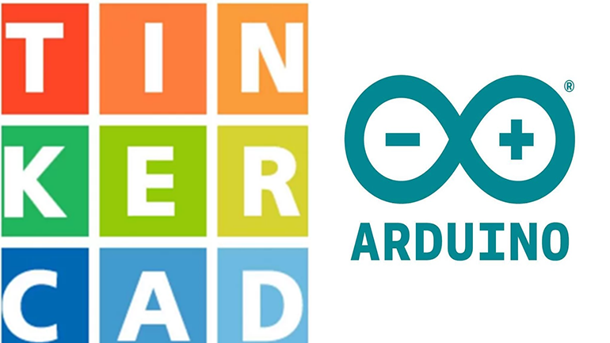
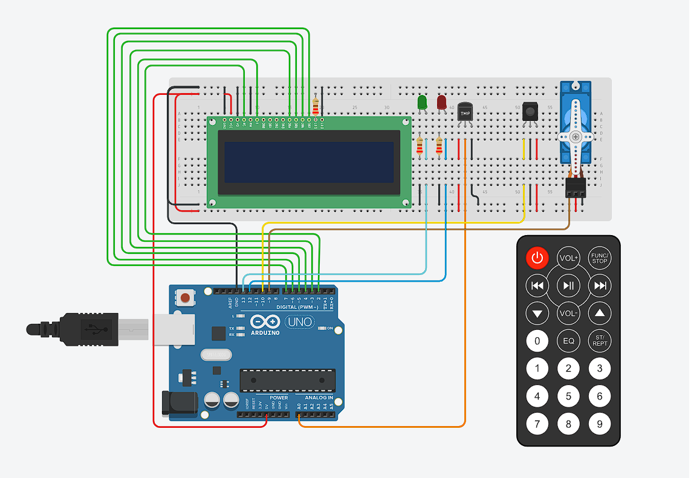
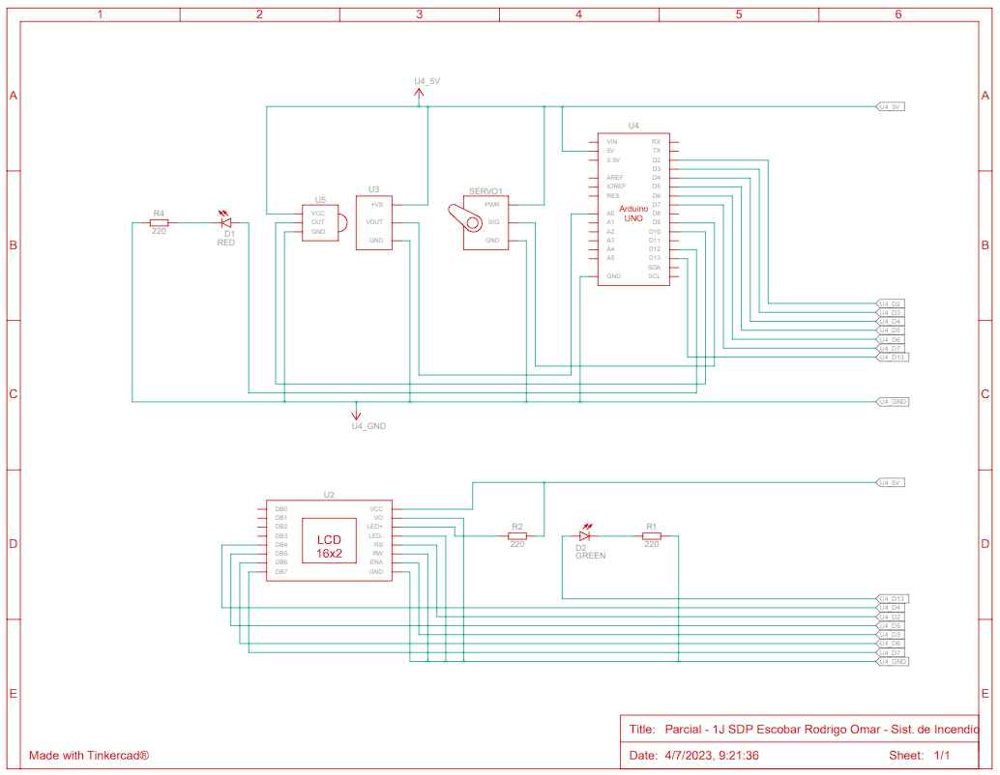

# Segundo parcial de SPD

<!-- UL-->
## Alumno:
---
* Rodrigo Omar Escobar

## Proyecto Sistema de Incendio con Arduino
---


## Materiales utilizados
---
* Arduino uno (1)
* Protoboard (1)
* Sensor de temperatura (1)
* Control IR (1)
* Sensor IR (1)
* Display LCD (1) 
* Servo motor (1)
* Leds (2)
* Resistencia de 220v (3)
* Cables
## Descripcion
---
El proyecto es un sistema de incendio, posee un sensor de temperatura, que va a captar la temperatura en el sector ubicado, un sensor IR (infrarrojo) que va a capturar las señales del control remoto IR, un servo motor que va a ser usado para simular una respuesta en caso de un incendio, una pantalla LCD 16 x 2, que nos a indicar todo lo que esta pasando en el sistema (temperatura actual, rangos de temp. segun la estacion del año, si el sistema esta encendido o apagado y tambien cuando se detecta el incendio), por ultimo se instalaron 2 led, uno verde que indica que el sistema esta encendido y otro rojo que se enciendo cuando el sistema esta apagado.
## Librerias de los objetos
---
```c++
#include <IRremote.h> // Control remoto
#include <Servo.h> // Servo motor
#include <LiquidCrystal.h> // LCD
```
## Inicialización y uso de los objetos
---
## Control IR y Sensor IR
receptorIR es una instancia de la clase IRrecv para recibir y decodificar datos infrarrojos.
Dentro del setup se habilita la recepción de datos infrarrojos.
```c++
#define PIN_CONTROL_IR 10 // Pin al que conectamos el Sensor IR

IRrecv receptorIR(PIN_CONTROL_IR);// Tipo de objeto IRrecv llmado receptorIR

void setup()
{
  receptorIR.begin(PIN_CONTROL_IR); // Inicializa el Control IR
}
```
## LCD
lcd es un objeto que recibe como parámetro cada pin de la placa de arduino.

Dentro del setup se incializa la comunicación entre la placa de ardunio y la pantalla lcd. 
Recibe como argumento 16, 2 que representan 16 caracteres por línea y 2 filas que se van a mostrar por la pantalla del mismo.
```c++
LiquidCrystal lcd (2,3,4,5,6,7);

void setup()
{
  lcd.begin (16, 2);//numero de lineas y columnas
}
```

## Servo
servoMotor es un objeto que permite controlar al servo motor.

Como los demas objetos lo inicializamos dentro del setup
Pomos controlar la posicion pasandolo por parametro los valores, servoMotor.write(0). 
El servoMotor se inicializa en la posición 0°
```c++
#define SERVOMOTOR 9
void setup()
{
  myservo.attach(SERVOMOTOR); // Inicializa el ServoMotor
}
```
## Funcion para prender y apagar el sistema
---
Como dice el titulo esta funcion se encarga de prender y apagar el sistema, para eso utilizamos el boton power (rojo) del Control IR, no se envia ningun dato por parametros, al iniciar el sistema permite el uso de las teclas configurada en la funcion principal (usar_control ()) que se explica mas abajo, si el sistema esta apagado esta funcion imprime en el lcd "Sistema apagado" y apaga la led verde y enciende la led roja

```c++
void loop()
{
  encender_apagar (); // Funcion para apagar y prender el sistema
}

void encender_apagar ()
{
  if (receptorIR.decode())
  {
    if (lectura_control == boton_power)
    {
      power = !power;
      //Serial.println (power);
    }
  }
    if (power) // Sistema prendido
  {
    usar_control ();// Funcion del control
    //lcd.display();
  }
  else // Sistema apagado
  {
    //lcd.noDisplay();
    lcd.setCursor(0, 0);
    lcd.print(" Sitema apagado");
    lcd.setCursor(0,1);
    lcd.print("                 ");
    encender_led (led_verde, LOW);// Funcion del los let al apagar el verde se prende el rojo
    myservo.write(90);  
  }
}
```
## Funcion principal (control remoto)
---
La funcion principal es el uso del control ir, ya que permite elegir la configuracion del sistema,
los botones que se usan son: el de encendido, el 1,2,3,4 y el boton play, este ultimo va actuar como boton de enmergencia, en caso de que el sensor de temperatura esta dañado o no detecta el incendio por "X" motivo, este boton enciende el sistema de riego (en este caso los servomotores), los botonos del 1 al 4 son para a seleccionar la estacion del año, donde cada estacion tiene un limite de temperatura diferente, al precionar cualquier otra tecla vuelve a preguntar por la estacion a elegir.
<!-- Bloque de codigos -->
```c++
void usar_control () // Funcion de los botones del control ir
{
    incendio(); // Funcion de incendio
  	encender_led (led_verde, HIGH); // Led verde encendido

    switch (lectura_control)
    {
      case boton_power: // Boton de encendido / estado "cero"
      lcd.setCursor(0, 0);
      lcd.print("Elija estacion");
      lcd.setCursor(0,1);
      lcd.print("Precione 1,2,3,4     ");
      estadoIncendio = false;
      myservo.write(90);
      break;
      case boton_1: // Boton 1 = Estacion Verano
      if (temperatura > TempMaxVerano)
      {
        estadoIncendio = true;
      }
      else
      {
        lcd.setCursor (5,0);
        lcd.print(" Verano          ");
        lcd.setCursor (14,2);
        lcd.print(TempMaxVerano);
        estadoIncendio = false;
      }
      break;
      case boton_2: // Boton 2 = Estacion Otonio
      if (temperatura > TempMaxOtonio)
      {
      	estadoIncendio = true;
      }
      else
      {
        lcd.setCursor (5,0);
        lcd.print(" Otonio          ");
        lcd.setCursor (14,2);
        lcd.print(TempMaxOtonio);
        estadoIncendio = false;
      }
      break;
      case boton_3: // Boton 3 = Estacion Invierno
      if (temperatura > TempMaxInvierno)
      {
        estadoIncendio = true;
      }
      else
      {
        lcd.setCursor (5,0);
        lcd.print(" Invierno          ");
        lcd.setCursor (14,2);
        lcd.print(TempMaxInvierno);
        estadoIncendio = false;
      }
      break;
      case boton_4: // Boton 4 = Estacion Primavera
      if (temperatura > TempMaxPrimavera)
      {
        estadoIncendio = true;
      }
      else
      {
        lcd.setCursor (5,0);
        lcd.print(" Primavera          ");
        lcd.setCursor (14,2);
        lcd.print(TempMaxPrimavera);
        estadoIncendio = false;
      }
      break;
      case boton_play: // Boton play / es un boton de emergencia en caso que el sensor no funcione
      if (receptorIR.decode())
      {
        if (estadoIncendio == false) // Activa la funcion incendio solo si esta apagado
        {
        estadoIncendio = true;
        }
        else // En caso de volver apretar el boton se reinicia el sistema
        {
          estadoIncendio = false;
          lectura_control = boton_power; // Estado cero, vuelve a preguntar que estacion elegir
          myservo.write(90);
        }
      break;
      default: // Al precionar cualquier otro boton se vuelve al estado cero
      lectura_control = boton_power;
      break;
      }
    receptorIR.resume();  // Reinicia el receptor ir y espera una nueva señal    
  } 
}
```

## Link del proyecto de tinkercad
---
* [Tinkercad](https://www.tinkercad.com/things/dBL6WebkRg6)

## Link del GBD
---
* [GDB](https://onlinegdb.com/al2YG95kS)

## Link del video funcionando
---
* [Youtube](https://youtu.be/DSy8zLC1euA)
